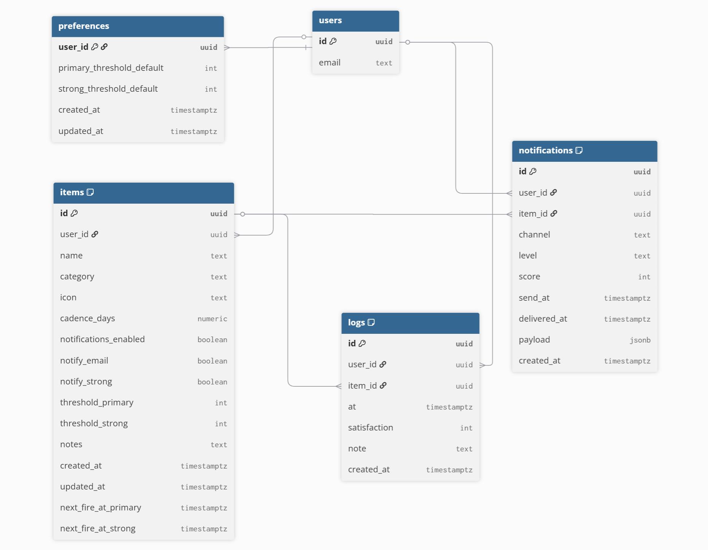
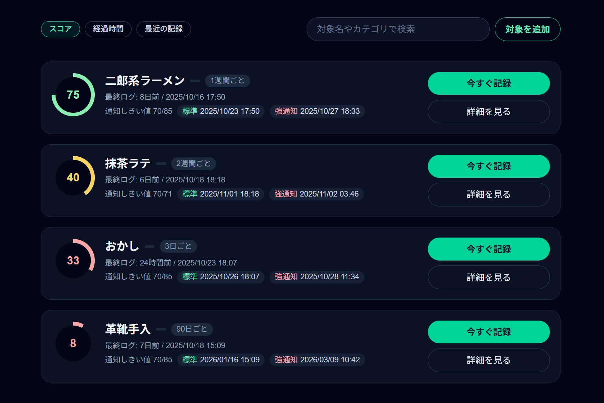
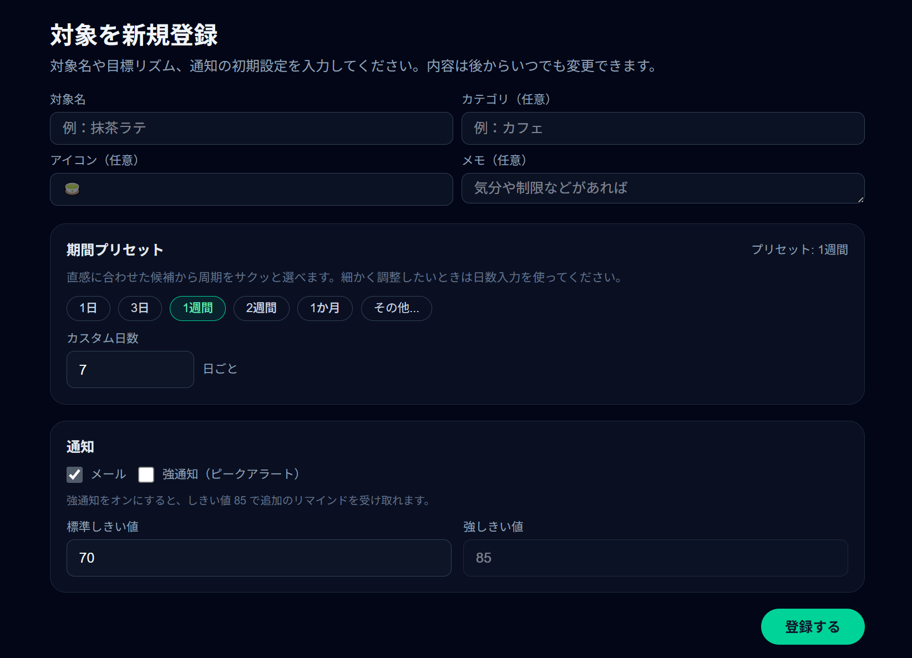
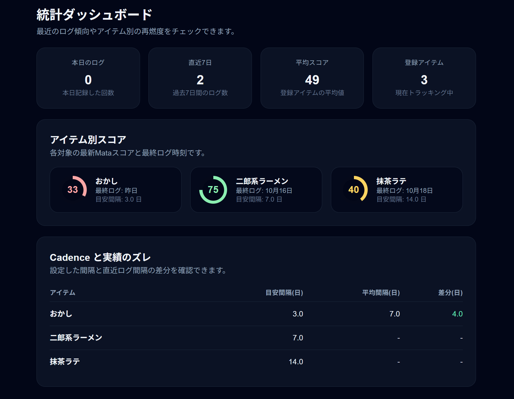

# またろぐ 

## 📌 概要
「またろぐ」は、ちょうどいい頃合いで、好きなことと再会するための個人向けリマインダーアプリです。

- デモ: https://matalog.vercel.app
- note: 

同じことを短期間で繰り返すと、脳は刺激に慣れて「飽き」を感じます。
一方で、少し時間を空けてから再び触れると、体験は新鮮に感じられます。

またろぐは、この飽きのリズムを数値化して、楽しさのピークで背中を押すツールです。
最後に行った時刻からの経過時間をもとに「再会スコア（またスコア）」を算出し、
設定したしきい値を超えたときだけ通知します。

対象は人・趣味・食べ物・習慣などなんでもOK。
「やるべきこと」ではなく、「もう一度やりたいこと」を記録し、
あなたの好きとの距離感をデザインします。

## 🎯 主な機能 
- 対象（アイテム）登録とカテゴリ管理、メモ・アイコン設定
- マジックリンクによるメールログイン（Supabase Auth / RLS）
- ログ記録（日時・満足度・ノート）とリアルタイムなまたスコア計算
- Edge Function によるメール通知
- ホーム / 統計ページでのスコア可視化と Cadence 分析

## 🛠️ 技術スタック 
| レイヤー | 使用技術 |
| --- | --- |
| 💻 フロントエンド | Next.js 15 (App Router), React 19, Tailwind CSS |
| 🗄️ バックエンド | Supabase Postgres, Row Level Security, Edge Functions |
| 🔐 認証 | Supabase Auth のメールリンク認証 |
| 📣 通知 | Resend API（メール）、Supabase Scheduler（Cron） |
| 📈 解析 | 独自のまたスコア算出ロジック (`src/lib/rii.ts`) |

## 📊 ER 図 


## 📂 ディレクトリ構成
```text
akilog/
├─ src/
│  ├─ app/
│  │  ├─ (auth)/login/page.tsx
│  │  ├─ (protected)/page.tsx
│  │  ├─ (protected)/items/[itemId]/page.tsx
│  │  ├─ (protected)/items/new/page.tsx
│  │  ├─ (protected)/stats/page.tsx
│  │  └─ layout.tsx
│  ├─ components/
│  │  ├─ item-card.tsx
│  │  └─ item-form.tsx
│  └─ lib/
│     ├─ rii.ts
│     ├─ store.ts
│     └─ supabase/
├─ supabase/
│  ├─ migrations/
│  └─ functions/
│     ├─ notify_dispatch/
│     └─ recalc_next_fire/
└─ README.md
```

## 📸 スクリーンショット
- アイテムカード画面  
  
- アイテム追加フォーム  
  
- 統計ダッシュボード  
  
