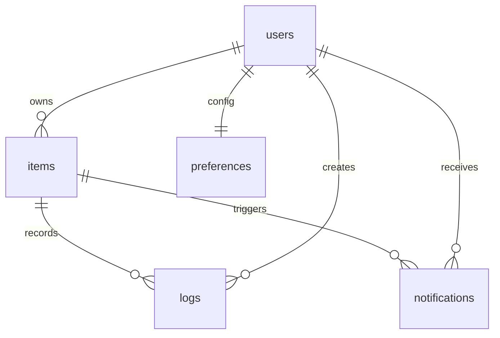
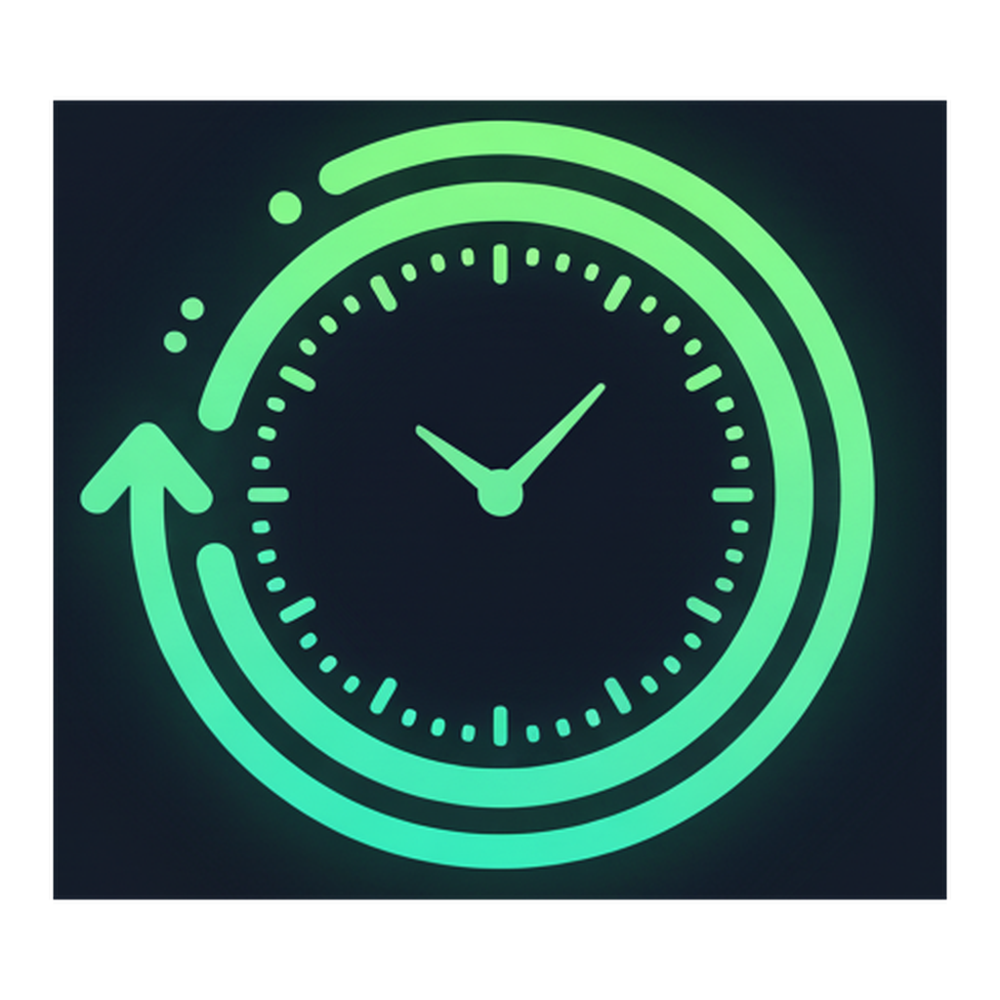

# またろぐ ☕️

## 概要 📌
「また食べたい」「また会いたい」をいい間隔で迎えに行くための、個人向けリマインダーアプリです。対象ごとの再会スコア（またスコア）を計算し、最適なタイミングで通知します。

## 主な機能 ✨
- 🗂️ 対象（アイテム）登録とカテゴリ管理、メモ・アイコン設定
- 📬 マジックリンクによるメールログイン（Supabase Auth / RLS）
- 🧮 ログ記録（日時・満足度・ノート）とリアルタイムなまたスコア計算
- 🔁 Edge Function による次回通知スケジュール再計算とメール通知
- 📊 ホーム / 統計ページでのスコア可視化と Cadence ドリフト分析

## 技術スタック 🛠️
| レイヤー | 使用技術 |
| --- | --- |
| 💻 フロントエンド | Next.js 15 (App Router), React 19, Tailwind CSS 4, Zustand |
| 🗄️ バックエンド | Supabase Postgres, Row Level Security, Edge Functions (Deno) |
| 🔐 認証 | Supabase Auth のメールリンク認証 |
| 📣 通知 | Resend API（メール）、Supabase Scheduler（Cron） |
| 📈 解析 | 独自のまたスコア算出ロジック (`src/lib/rii.ts`) |

## ER 図 🧭


## ディレクトリ構成（抜粋）🗺️
```text
akilog/
├─ src/
│  ├─ app/
│  │  ├─ (auth)/login/page.tsx
│  │  ├─ (protected)/page.tsx
│  │  ├─ (protected)/items/[itemId]/page.tsx
│  │  ├─ (protected)/items/new/page.tsx
│  │  ├─ (protected)/stats/page.tsx
│  │  └─ layout.tsx
│  ├─ components/
│  │  ├─ item-card.tsx
│  │  └─ item-form.tsx
│  └─ lib/
│     ├─ rii.ts
│     ├─ store.ts
│     └─ supabase/
├─ supabase/
│  ├─ migrations/
│  └─ functions/
│     ├─ notify_dispatch/
│     └─ recalc_next_fire/
├─ public/
│  └─ dark_square_1024.png
└─ README.md
```

## スクリーンショット 📸


---
詳細な仕様や通知ロジックについては `supabase/functions` や `src/lib` のソースコードをご覧ください。
